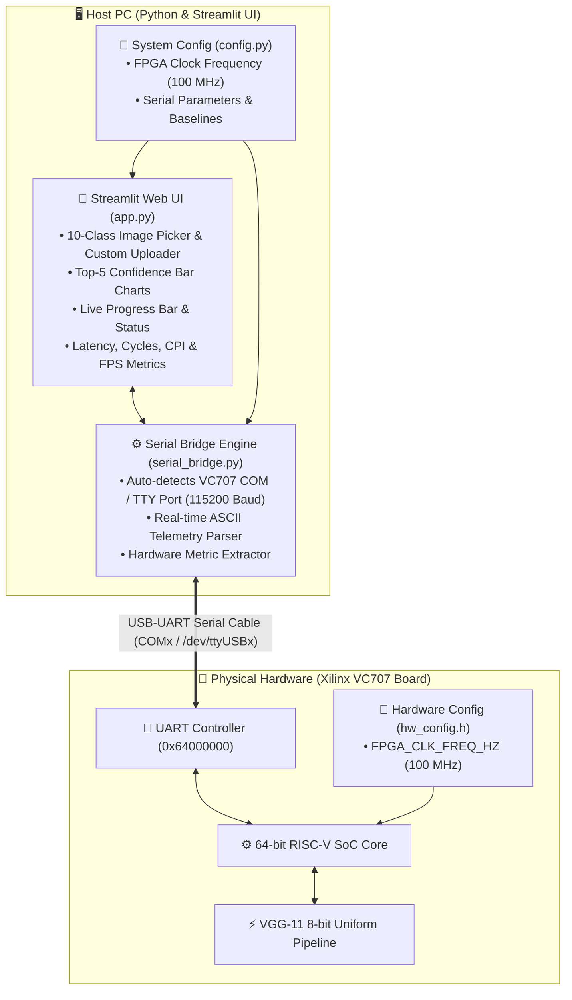

# 🚀 Xilinx VC707 FPGA Edge-AI Live Demonstration & Hardware Bridge

**Interactive Python (Streamlit) Graphical Dashboard & RISC-V Bare-Metal UART Telemetry Bridge for VGG-11 Deep Learning Inference**

---

## 📌 1. Project Overview & Objective

When running deep neural network inference on bare-metal FPGA hardware (specifically the **Xilinx Virtex-7 VC707** evaluation board hosting a 64-bit RISC-V SoC), the hardware operates with minimal visual feedback. To an audience, client, or technical evaluator, raw serial terminal logs do not clearly convey the internal pipeline execution or live model capabilities.

### What This Project Solves:
This project provides a **complete, standalone Hardware-in-the-Loop (HIL) Demonstration Platform**:
1. **Interactive Control Cockpit (Streamlit UI):** An intuitive web dashboard allowing the user to select test images, trigger real-time hardware execution, and visualize top-5 classification probabilities.
2. **Layer-by-Layer Acceleration Telemetry:** The UI parses real-time UART tokens emitted by the VC707, animating a live progress bar as each convolutional, pooling, and dense classifier layer executes on hardware.
3. **Hardware Performance Profiling:** Accurately displays real hardware clock cycles, execution latency (ms/s), frame throughput (FPS), retired instructions, and Cycles Per Instruction (CPI).
4. **All 10 CIFAR-10 Classes Embedded:** Pre-quantized and embedded into firmware for 0 ms data transfer overhead on all standard classes.
5. **Live Arbitrary Custom Image Streaming:** Users can drag-and-drop any custom image from their camera or web to stream 3,072 bytes over UART in ~0.26s and classify live on silicon.
6. **Offline Simulator Fallback:** Automatically switches to a high-fidelity hardware simulation mode if the physical VC707 board is disconnected, enabling live presentations anywhere.

---

## 🏗️ 2. System Architecture



---

## 📁 3. Project Directory Structure

```
VC707_Live_Demo_UI/
├── README.md                          # Comprehensive User Guide & Handout
├── firmware/                          # Bare-metal C firmware for VC707
│   ├── hw_config.h                   # [CENTRAL CONFIG] Hardware clock frequency (100 MHz)
│   ├── vgg11_rv_demo_vc707.elf       # [PRE-COMPILED] RISC-V Bare-metal binary for VC707
│   ├── vgg11_pc_demo.exe             # [PRE-COMPILED] x86 Windows PC test executable
│   ├── main_vc707_demo.c             # Firmware entry point with structured UART telemetry
│   ├── inference_ops.h / .c          # Quantized 8-bit VGG-11 neural network kernels
│   ├── vgg11_baseline_unpacked.h     # 8-bit uniform weight declarations
│   ├── vgg11_baseline_unpacked.cc    # Pre-quantized layer weight arrays
│   ├── cifar_test_image.h            # 10 Embedded test images (Airplane, Auto, Bird, Cat, ...)
│   ├── hw_metrics.h                  # Hardware cycle & mtime counter macros
│   ├── baremetal_libc_stubs.c        # UART string output & bare-metal stubs
│   ├── boot1.S / link_uart.ld        # RISC-V VC707 DDR bootloader & linker script
│   └── Makefile                      # Universal build script (Linux & Windows toolchains)
└── python_ui/                         # Streamlit Web Application & Python Bridge
    ├── config.py                      # [CENTRAL CONFIG] Python clock & system configuration
    ├── app.py                         # Interactive Streamlit graphical dashboard
    ├── serial_bridge.py               # Serial port listener & telemetry parser
    ├── sample_images/                 # Real CIFAR-10 photographic test samples (.png)
    ├── export_sample_images.py        # Sample image generator utility
    ├── requirements.txt               # Python package dependencies
    ├── run_demo.bat                   # Double-clickable Windows launcher
    └── run_demo.sh                    # 1-Click Linux (Ubuntu) launcher
```

---

## ⚙️ 4. Centralized Hardware & System Configuration

If the hardware bitstream is synthesized at a different clock speed (e.g. 50 MHz, 100 MHz, 150 MHz, 200 MHz), you can configure the clock frequency in **one central place** without touching algorithm or GUI code:

### A. For C Firmware: [`firmware/hw_config.h`](file:///C:/Mubashir-BTU/Thesis/Codes/Danial/DATE2027_Eval/VC707_Live_Demo_UI/firmware/hw_config.h)
```c
#define FPGA_CLK_FREQ_HZ    100000000ULL  /* 100 MHz (100,000,000 Hz) */
```

### B. For Python Dashboard & Bridge: [`python_ui/config.py`](file:///C:/Mubashir-BTU/Thesis/Codes/Danial/DATE2027_Eval/VC707_Live_Demo_UI/python_ui/config.py)
```python
FPGA_CLK_FREQ_HZ = 100_000_000  # 100 MHz
DEFAULT_BAUD_RATE = 115200
```

* Changing this frequency automatically updates all millisecond latency conversions, execution durations, and Throughput (FPS) calculations across the entire system.

---

## 🔌 5. Step-by-Step Hardware & Software Setup

```
+---------------------------------------+                     +---------------------------------------+
|          Xilinx VC707 Board           |                     |                Host PC                |
|                                       |                     |                                       |
|  [ Micro-USB "UART" Port (J4) ] ------+====(USB Cable)=====>+ [ USB Port (COMx or /dev/ttyUSBx) ]  |
|                                       |                     |   Streamlit Dashboard (app.py)        |
+---------------------------------------+                     +---------------------------------------+
```

### Complete Hardware Execution Flow:

1. **Prepare the SD Card:**
   * Copy `firmware/vgg11_rv_demo_vc707.elf` to the root of a FAT32-formatted SD card.
   * Insert the SD card into the SD card slot on the VC707 board.
2. **Connect the USB-UART Cable:**
   * Connect a standard Micro-USB cable from the **UART port (J4)** on the VC707 board to your PC.
3. **Power On the Board:**
   * Turn ON the power switch on the VC707 board. The onboard bootloader will load the `.elf` payload into DDR memory.
4. **Ensure No Serial Terminal is Open:**
   * Make sure standalone terminal monitors (such as **Minicom on Linux**, or **PuTTY / TeraTerm on Windows**) are **completely closed**. Serial ports are exclusive; Python needs sole access to communicate with the board.
5. **Launch the Streamlit Dashboard on PC:**
   * On **Windows**: Double-click `python_ui/run_demo.bat` (or run `streamlit run app.py`).
   * On **Linux / Ubuntu**:
     ```bash
     cd python_ui
     bash run_demo.sh
     # (or: streamlit run app.py)
     ```
6. **Connect & Trigger in Browser:**
   * Open your browser at `http://localhost:8501`.
   * In the sidebar dropdown, select your active hardware port:
     * On **Linux**: Select `/dev/ttyUSB0` (or `/dev/ttyUSB1`).
     * On **Windows**: Select `COMx - Silicon Labs CP210x` (e.g. `COM4`).
   * Pick an image from the 10-class dropdown (or upload a custom image) and click **"🚀 Execute"**.
   * The board will execute on command, and real-time layer progress, hardware latency, clock cycles, CPI, and top-5 scores will render dynamically!

---

## 📡 6. UART Protocol & Multi-Image Commands

The VC707 firmware outputs structured, machine-parseable ASCII tokens over UART at **115200 baud, 8-N-1**:

| UART Tag | Example Syntax | Description |
|---|---|---|
| `[START]` | `[START] model=VGG-11 image_idx=1 image_name=airplane` | Firmware boots and starts inference pass |
| `[LAYER]` | `[LAYER] idx=1 name=Conv2d_1 progress=12.5%` | Layer start event; drives UI progress bar |
| `[LAYER_DONE]` | `[LAYER_DONE] idx=1 name=Conv2d_1` | Layer execution completed on FPGA |
| `[METRIC]` | `[METRIC] cycles=3481477418 instrs=2231361891 time_ms=34.81` | Real hardware cycle & instruction counters |
| `[TOP5]` | `[TOP5] 0:airplane=-28 1:automobile=-270 3:cat=416 ...` | Output logits across all classes |
| `[PRED]` | `[PRED] class_id=3 class_name=cat status=PASS` | Predicted winning class name and ID |
| `[DONE]` | `[DONE]` | Full inference cycle finished |
| `[IDLE]` | `[IDLE] Ready for next command...` | Board waiting for next command |

### Supported Host Commands (Sent from UI to Board):
* `0\n` through `9\n` $\rightarrow$ Triggers inference on **Built-in Samples #0 to #9** (0 ms transfer)
* `U\n` + 3,072 bytes $\rightarrow$ Streams arbitrary **Custom User Photo** to FPGA (~0.26s transfer)
* `G\n` $\rightarrow$ Triggers inference on default test image

---

## 🛠️ 7. Troubleshooting & Best Practices

| Observation / Issue | Potential Cause | Solution |
|---|---|---|
| **UI Stays IDLE / Times Out After Clicking Run** | A serial monitor (Minicom, PuTTY, TeraTerm) is open in the background. | **Close the external terminal.** Serial ports can only be opened by one application at a time. |
| **Permission Denied on Linux (`/dev/ttyUSB0`)** | Current Linux user does not have read/write access to dialout serial devices. | Run: `sudo chmod 666 /dev/ttyUSB0` or add user to group: `sudo usermod -aG dialout $USER` (then log out and log back in). |
| **Garbled / Corrupted Text in Terminal** | Baud rate mismatch. | Ensure baud rate is set to **`115200`** in both firmware and UI. |
| **Presenting Without Hardware Board** | VC707 board is not physically connected. | Select **`🟡 SIMULATION_MODE`** in the dropdown. The UI will run a high-fidelity simulation with accurate model timings and metrics. |

---

---

## 📊 8. Hardware Performance Metrics Guide

The dashboard evaluates and presents 5 fundamental Edge-AI hardware performance indicators:

| Metric | Symbol | Definition | Mathematical Formula |
|---|---|---|---|
| **⏱️ Execution Latency** | $\text{Latency}$ | Total turnaround time required to classify one input image from start to final prediction. | $\text{Latency (ms)} = \frac{\text{Clock Cycles}}{\text{FPGA Clock Frequency (Hz)}} \times 1000$ |
| **🔄 Clock Cycles** | $\text{Cycles}$ | Total hardware clock pulses elapsed on silicon during the forward pass. Measured via RISC-V `mcycle`. | $\Delta\text{Cycles} = \text{mcycle}_{\text{end}} - \text{mcycle}_{\text{start}}$ |
| **🔢 Retired Instructions** | $\text{Instrs}$ | Total count of machine-level assembly instructions executed and retired by the CPU core. Measured via `minstret`. | $\Delta\text{Instrs} = \text{minstret}_{\text{end}} - \text{minstret}_{\text{start}}$ |
| **⚖️ CPI (Cycles Per Instruction)** | $\text{CPI}$ | Microarchitectural execution efficiency. Measures the average clock cycles consumed per instruction. | $\text{CPI} = \frac{\text{Clock Cycles}}{\text{Retired Instructions}}$ |
| **⚡ Frame Throughput** | $\text{FPS}$ | Real-time classification speed. Measures how many full images the system can process in one second. | $\text{Throughput (FPS)} = \frac{1000}{\text{Latency (ms)}}$ |

### 💡 Key Takeaway for Presentations:
* **Latency & Cycles:** Reflect processing speed and workload complexity on the hardware.
* **CPI:** Reflects pipeline efficiency and memory subsystem performance.
* **Throughput (FPS):** Demonstrates real-time capability for live camera feeds (where standard video requires 30–60 FPS).


